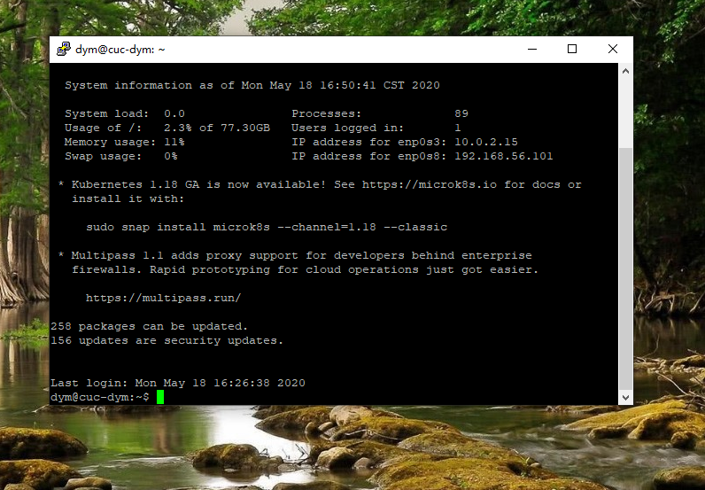

# 第一章：（实验）无人值守安装iso
# 实验问题
1.如何配置无人值守安装iso并在Virtualbox中完成自动化安装。

2.Virtualbox安装完Ubuntu之后新添加的网卡如何实现系统开机自动启用和自动获取IP？

3.如何使用sftp在虚拟机和宿主机之间传输文件？

# 实验环境
+ Virtualbox
+ 服务器：Ubuntu 18.04 Server 64bit（需要配置双网卡，实现ssh登录）
+ 宿主机： Windows10

# 实验要求
+ 定制一个普通用户名和默认密码
+ 定制安装OpenSSH Server
+ 安装过程禁止自动联网更新软件包

# 实验过程
注：以下实验所有截图以用户名dym、桌面背景为身份标识
## 网络配置 
+ 添加并启用Host-Only网卡


+ netplan配置 
```
#查看网卡信息
ifconfig

#查看配置文件
ls /etc/netplan

#修改配置文件
sudo vi /etc/netplan/01-netcfg.yam1

#启用配置
sudo netplan apply
```


可看到第二块网卡ip地址为：192.168.56.101

## 远程连接配置
+ 在服务器上安装openssh-server
 ``` 
#更新源
sudo apt-get update

#安装OpenSSH服务器应用
sudo apt install openssh-server

#检查ssh服务是否开启
ps aux | grep ssh
```

+ 使用putty远程连接
```        
1.在putty中进行远程连接
2.输入密码即可远程登录服务器
```

## putty免密登录
+ 使用puttygen.exe生成公私钥对，私钥保存至本地
+ 公钥上传至服务器
```
mkdir .ssh
cd .ssh
sudo vim authorized_keys
```
## 使用psftp在虚拟机和宿主机之间传输文件
+ 连接：open host.name 
+ 上传：put<文件路径+文件名>
+ 下载：get<文件路径+文件名>
```    
put C:\Users\18235\ubuntu-18.04.1-server-amd64.iso
```


## 创建定制版无人值守iso镜像文件
```
# 在当前用户目录下创建一个用于挂载iso镜像文件的目录
mkdir loopdir

# 挂载iso镜像文件到该目录
sudo mount -o loop ubuntu-18.04.1-server-amd64.iso loopdir/

# 创建一个工作目录用于克隆光盘内容
mkdir cd

# 同步光盘内容到目标工作目录
rsync -av loopdir/ cd

# 卸载iso镜像
sudo umount loopdir

# 进入目标工作目录，之后在虚拟机里的操作都在该目录下进行
cd cd/

# 添加自动安装菜单选项
sudo vim isolinux/txt.cfg

# 在txt.cfg中添加以下内容并强制保存退出
label autoinstall
       menu label ^Auto Install Ubuntu Server
       kernel /install/vmlinuz
       append  file=/cdrom/preseed/ubuntu-server-autoinstall.seed debian-installer/locale=en_US console-setup/layoutcode=us keyboard-configuration/layoutcode=us console-setup/ask_detect=false localechooser/translation/warn-light=true localechooser/translation/warn-severe=true initrd=/install/initrd.gz root=/dev/ram rw quiet
```

+ 下载定制好的ubuntu-server-autoinstall.seed
```
#使用psftp传至服务器
put C:\ubuntu-server-autoinstall.seed

# 移动到指定目录下
sudo mv ubuntu-server-autoinstall.seed ~/cd/preseed/

# 生成md5sum.txt
sudo su -
find . -type f -print0 | xargs -0 md5sum > /tmp/md5sum.txt
```


+ 新建shell脚本，添加脚本并退出
```
# 新建脚本
sudo vim shell
			
# 封闭改动后的目录到.iso
IMAGE=custom.iso
BUILD=~/cd/
			
mkisofs -r -V "Custom Ubuntu Install CD" \
	        -cache-inodes \
	        -J -l -b isolinux/isolinux.bin \
	        -c isolinux/boot.cat -no-emul-boot \
			        -boot-load-size 4 -boot-info-table \
			        -o $IMAGE $BUILD
```
+ 执行shell脚本
```
sudo bash shell 
```
mkisofs命令未找到


+ 安装genisoimage
```
sudo apt-get install genisoimage
```
+ 使用psftp导出.iso镜像文件
```
lcd D:\
get custom.iso
```


+ 进行无人值守安装ISO，视频详见于实验结果


  
## 对比定制ubuntu-server-autoinstall.seed与官方实例文件
1.支持中英等多种语言，跳过安装时语言支持的设置 

2.设置链路等待超时和DHCP超时为5s，选择手动配置网络 

3.配置网络 

4.配置主机名，域名 

5.设置用户名和默认密码 

6.设置时区以及不使用npt设置时钟 

7.LVM分区中逻辑卷设置为最大。分成/home，/var和/tmp三个分区（multi） 

8.安装时不用网络镜像 

9.定制安装OpenSSH Server，不自动升级(select none)；将软件升级模式设置为automatically(select unattended-upgrades)


# 实验结果
###   [无人值守自动安装iso视频链接](https://www.bilibili.com/video/av98332463/)

# 参考文献

+ [2015-linux-public-tyushua1](https://github.com/CUCCS/2015-linux-public-tyushua1/commit/6e084fdfdb5acd4dc3dff6abc292b2f0173ae4fa?short_path=201e948)

+ [无人值守安装ISO镜像课件](https://c4pr1c3.github.io/LinuxSysAdmin/chap0x01.exp.md.html#/iso)

+ [Linux系统与网络管理 第一章视频](https://www.bilibili.com/video/BV1S7411W7aH)


