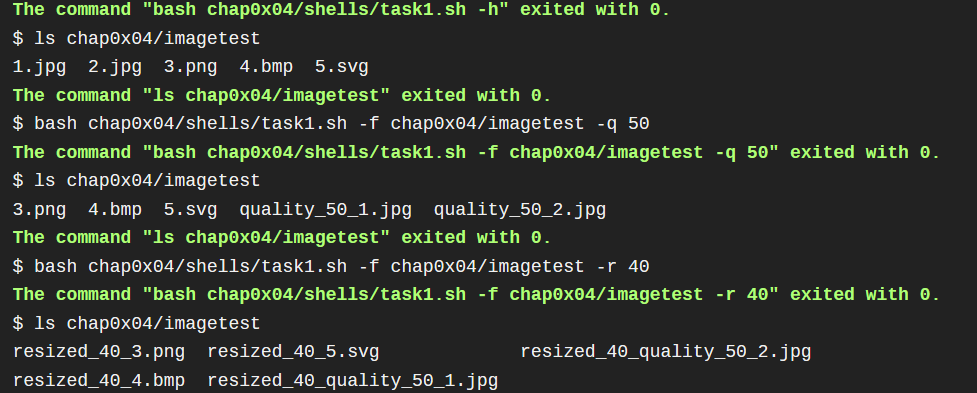
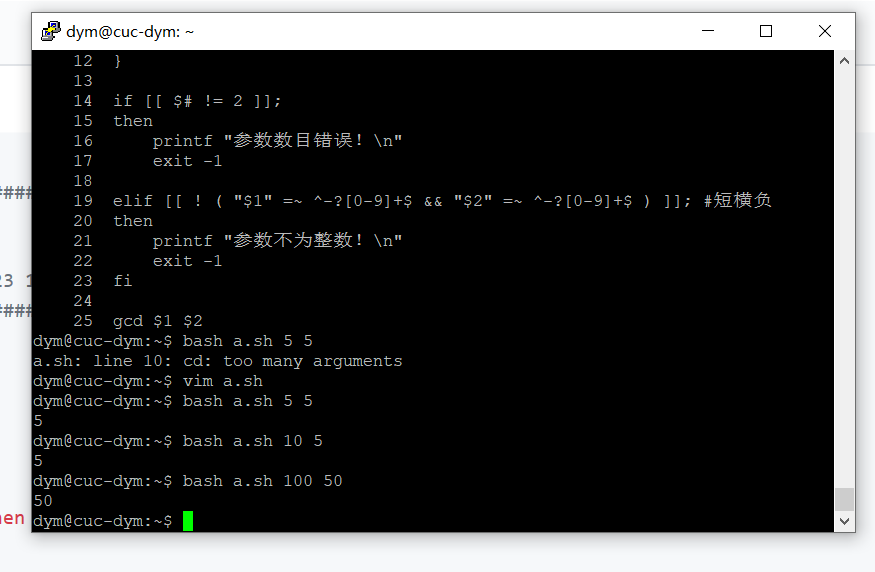

# 第四章：shell脚本编程基础（实验）

## 实验环境
- 虚拟机系统：ubuntu 18.04
- 宿主机系统：`virtubox`

## 实验要求
- 上述任务的所有源代码文件必须单独提交并提供详细的--help脚本内置帮助信息
- 任务二的所有统计数据结果要求写入独立实验报告
  
## 实验任务
- 本次实验所有脚本执行效果和完整结果，及shellcheck检查所有脚本后的结果详见[travis展示](https://travis-ci.com/github/cuc-dengym/linux-2020-cuc-dengym)
  
#### 任务一：用bash编写一个图片批处理脚本，实现以下功能：
- 功能完成情况
   - [x] 支持命令行参数方式使用不同功能
   - [x] 支持对指定目录下所有支持格式的图片文件进行批处理
     - [x] 支持以下常见图片批处理功能的单独使用或组合使用
       - [x] 支持对jpeg格式图片进行图片质量压缩
       - [x] 支持对jpeg/png/svg格式图片在保持原始宽高比的前提下压缩分辨率
       - [x] 支持对图片批量添加自定义文本水印
       - [x] 支持批量重命名（统一添加文件名前缀或后缀，不影响原始文件扩展名）
       - [x] 支持将png/svg图片统一转换为jpg格式图片
- 脚本内置帮助信息：
```
usage: bash $1 -f <filepath | filename> | -d <directory> [-q <quality>] [-r <scale>] ...


Attention! If image type is not supported,the operation will be skipped. 

optional arguments:
  -f		filename or filepath

  -q		jpeg/jpg compressiblity

  -r		resize by sacle(only png/jpeg/svg)

  -t		draw text watermark in center(only png/jpeg/jpg/svg/bmp)

  -p		add prefix in filename(only png/jpeg/jpg/svg/bmp)

  -s		add suffix in filename(only png/jpeg/jpg/svg/bmp)

  -c		convert png/svg to jpg

  --help		show this help message and exit
```
- 脚本验证


    
#### 任务二：用bash编写一个文本批处理脚本，对以下附件分别进行批量处理完成相应的数据统计任务：
- 功能完成情况
    - [x] 统计不同年龄区间范围（20岁以下、[20-30]、30岁以上）的球员**数量**、**百分比**
    - [x] 统计不同场上位置的球员**数量**、**百分比**
    - [x] 名字最长的球员是谁？名字最短的球员是谁？
    - [x] 年龄最大的球员是谁？年龄最小的球员是谁？
- 脚本内置帮助信息
```
usage: bash $1 [-h] [-i]...

optional arguments:

  -i		show information about wordcupplayerinfo.tsv

  -a		count the number and percentage of players in different age ranges

  -b		count the number and percentage of players on different positions

  -d		show the longest and shorest name of players

  -c		show the oldest and youngest players

  --help		show this help information and exit

for examples:
  bash $1 -i		show information about worldcupplayerinfo.tsv
``` 
- 统计数据结果
``` 
  ------------------------------
  range	number	percentage
  ------------------------------
  [<20]	9	01.22%
  [20-30]	600	81.52%
  [>30]	127	17.26%
  ------------------------------
  ----------------------------------
  position	number	percentage
  ----------------------------------
  Défenseur	1	00.14%
  Midfielder	268	36.41%
  Defender	236	32.07%
  Forward 	135	18.34%
  Goalie  	96	13.04%
  ----------------------------------
  ------------------------------

  number	name
  1	Francisco Javier Rodriguez
  2	Lazaros Christodoulopoulos
  3	Liassine Cadamuro-Bentaeba
  ------------------------------
  the maximal length is:26
  ------------------------------
  ------------------------------

  number	name
  1	Jô
  ------------------------------
  the minimal length is:2
  ------------------------------
  ------------------------------

  number	age	name
  1	42	Faryd Mondragon
  ------------------------------
  the maxnmal age is:42
  ------------------------------
  ------------------------------

  number	age	name
  1	18	Fabrice Olinga
  2	18	Luke Shaw
  ------------------------------
  the minimal age is:18
  ------------------------------
```
#### 任务三：用bash编写一个文本批处理脚本，对以下附件分别进行批量处理完成相应的数据统计任务：
  - Web服务器访问日志
    - [x] 统计访问来源主机TOP 100和分别对应出现的总次数
    - [x] 统计访问来源主机TOP 100 IP和分别对应出现的总次数
    - [x] 统计最频繁被访问的URL TOP 100
    - [x] 统计不同响应状态码的出现次数和对应百分比
    - [x] 分别统计不同4XX状态码对应的TOP 10 URL和对应出现的总次数
    - [x] 给定URL输出TOP 100访问来源主机
 - 脚本内置帮助信息
```
usage: bash $1 [-h <filename>] [-u <filename> <url>] ...

optional arguments:

  -a            top 100 hosts

  -b            top 100 ips

  -c            top 100 urls

  -d            state codes statistics

  -e            top 10 url with state codes 4xx

  -u            specify url and display top 100 hosts

  --help            show this help message and exit

for example:
  bash $1 -u "/ksc.html"	display top 100 access hosts
``` 
- 统计数据结果
  [task3_result](task3_result.md)
## 课内作业

   题目：求2个数的最大公约数，要求：

   - 通过命令行参数读取2个整数，对不符合参数调用规范（使用小数、字符、少于2个参数等）的脚本执行要给出明确的错误提示信息，并退出代码执行

  - shell脚本代码如下：
    
```shell
#!/usr/bin/env/bash

set -eo pipefail
    
function gcd {
    if [[ $2 == 0 ]] ;then
        echo $1
        return 0
    else
            cd $2 $(( "$1" % "$2" )) 
    fi
}
    
if [[ $# != 2 ]];
then
    printf "参数数目错误！\n"
    exit -1
     
elif [[ ! ( "$1" =~ ^-?[0-9]+$ && "$2" =~ ^-?[0-9]+$ ) ]]; #短横负
then
    printf "参数不为整数！\n"
    exit -1
fi
     
gcd $1 $2
```
- 脚本验证




### 参考文献

- [awk](https://www.runoob.com/linux/linux-comm-awk.html )
- [travis-ci]( https://www.cnblogs.com/morang/p/7228488.html )
-  [imagemagick](http://www.imagemagick.org/script/command-line-tools.php )

-  [https://github.com/CUCCS/linux-2019-jckling](https://github.com/CUCCS/linux-2019-jckling/blob/0x04/0x04/实验报告.md)  
