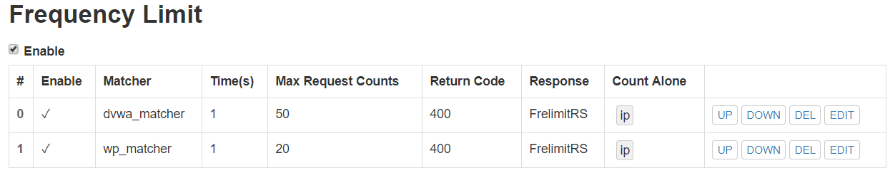

# 第五章：Web服务器（实验）

## 实验环境
- Virtualbox
- 服务器：Ubuntu 18.04 Server 64bit（需要配置双网卡，实现ssh登录）
- 宿主机： Windows10
- Nginx
- VeryNginx
- Wordpress 4.7
- DVWA v1.9
- MySQL
- PHP
- host-only ip地址为192.168.56.101
## 实验环境配置过程

#### 【客户端添加域名解析】
- 查看服务器ip地址


- 客户端Windows修改` C:\Windows\System32\drivers\etc`中`hosts`文件，添加域名解析


#### 【Nginx/MySQL/PHP】
- 安装nginx
```
  sudo apt install nginx
  sudo nginx -t
```


- 客户端访问服务器80端口


- 安装MySQL
```
  sudo apt install mysql-server
```

- 安装PHP
```
  sudo apt install php-fpm php-mysql
  php --version
```


#### 【VeryNginx】

- 根据文档提示安装配置VeryNginx
```bash
    # 预安装一些必要的库与依赖项
    sudo apt install -y libpcre3-dev libssl1.0-dev zlib1g-dev python3 unzip gcc make

    # 克隆verynginx仓库到本地
    git clone https://github.com/alexazhou/VeryNginx.git

    cd VeryNginx

    #安装verynginx
    sudo python3 install.py install
```


- 修改`/opt/verynginx/openresty/nginx/conf/nginx.conf`配置文件
```bash
  # 将user从Nginx修改为www-data
  # 修改server监听端口为8080以防止与Nginx冲突
  sudo vim /opt/verynginx/openresty/nginx/conf/nginx.conf
    
  #启动nginx服务
  sudo /opt/verynginx/openresty/nginx/sbin/nginx
```
- `sudo chmod -R 777 /opt/verynginx/verynginx/configs`添加nginx进程对`/opt/verynginx/verynginx/configs/`的写权限

- 主机访问8080端口


- 进入verynginx控制台


输入默认账号密码：
    ```
    User: verynginx
    Password: verynginx 
    ```
    登陆成功，进入配置界面


#### 【WordPress】
- 下载WordPress
```bash
  #切换到可写目录，然后通过键入以下命令下载压缩版本：
  cd /tmp
  sudo wget https://wordpress.org/wordpress-4.7.zip
  
   #解压缩压缩文件以创建WordPress目录结构
  unzip wordpress-4.7.zip

  #将示例配置文件复制到WordPress实际读取的文件名
  cp /tmp/wordpress/wp-config-sample.php /tmp/wordpress/wp-config.php

  #将解压后的wordpress移到指定路径
  sudo mkdir /var/www/html/wp.sec.cuc.edu.cn

  sudo cp -ar /tmp/wordpress/. /var/www/html/wp.sec.cuc.edu.cn

  #将所有权分配给www-data用户和组(这是Nginx运行的用户和组)
  sudo chown -R www-data:www-data /var/www/html/wp.sec.cuc.edu.cn
```

- 创建数据库和供WordPress使用的用户
```bash
    sudo mysql

    mysql> CREATE DATABASE wordpress DEFAULT CHARACTER SET utf8 COLLATE utf8_unicode_ci;
  
    mysql> GRANT ALL ON wordpress.* TO 'wordpressuser'@'localhost' IDENTIFIED BY 'password'

    mysql> FLUSH PRIVILEGES;

    mysql> exit;
```
- 安装其他PHP扩展 
```bash
  sudo apt install php-curl php-gd php-intl php-mbstring php-soap php-xml php-xmlrpc php-zip

  sudo systemctl restart php7.2-fpm
```

#### 【DVWA】
- 下载安装
```bash
  #将DVWA源码clone到可写目录
  sudo git clone https://github.com/ethicalhack3r/DVWA /tmp/DVWA

  #拷贝至/var/www/html
  sudo mkdir /var/www/html/dvwa.sec.cuc.edu.cn
  sudo cp -r /tmp/DVWA/. /var/www/html/dvwa.sec.cuc.edu.cn
```

- 创建数据库和供DVWA使用的用户
```bash
  #登录MySQL
  sudo mysql

  #为dvwa创建数据库
  mysql> CREATE DATABASE dvwa DEFAULT CHARACTER SET utf8 COLLATE utf8_unicode_ci;
  mysql> GRANT ALL ON  dvwa.* TO 'dvwauser'@'localhost' IDENTIFIED BY 'password';
  mysql> FLUSH PRIVILEGES;

  #退出MySQL
  mysql> exit;
```


    
## 实验基本要求
- [x] 配置PHP-FPM进程的反向代理在nginx服务器上
- 配置Nginx服务器块文件
  - 创建新服务器块配置文件
    ```bash
    sudo vim /etc/nginx/sites-available/wp.sec.cuc.edu.cn
    ```
    从中写入如下类似：
    ```bash
    server {
        listen 192.168.56.101:8080;
        root /var/www/html/wp.sec.cuc.edu.cn;
        index index.php index.html index.htm index.nginx-debian.html;
        server_name wp.sec.cuc.edu.cn;
        location / {
            #try_files $uri $uri/ =404;
            try_files $uri $uri/ /index.php$is_args$args;
        }

        #配置PHP-FPM进程的反向代理配置在nginx服务器上    
        location ~ \.php$ {
            include snippets/fastcgi-php.conf;
            fastcgi_pass unix:/var/run/php/php7.2-fpm.sock;
        }

        location ~ /\.ht {
            deny all;
        }
    }
    ```

- [x] 完成通过 http://wp.sec.cuc.edu.cn访问`wordpress`
- 创建从新服务器块配置文件（在/etc/nginx/sites-available/目录中）到/etc/nginx/sites-enabled/目录的符号链接来启用新服务器块
  ```bash
  sudo ln -s /etc/nginx/sites-available/wp.sec.cuc.edu.cn /etc/nginx/sites-enabled/
  ```
  - 从/sites-enabled/目录取消链接默认配置文件
  ```bash
  sudo unlink /etc/nginx/sites-enabled/default
    ```
  - 测试新配置文件的语法是否错误并重启服务
  ```bash
    sudo nginx -t
    sudo systemctl reload nginx
    ```

- 设置WordPress配置文件
    ```bash
    #从WordPress密钥生成器获取安全值
    curl -s https://api.wordpress.org/secret-key/1.1/salt/
    #将生成的配置行直接粘贴到配置文件中，替换原来包含虚拟值的部分以设置安全密钥
    sudo vim /var/www/html/wp.sec.cuc.edu.cn/wp-config.php

    #同时在文件开头修改数据库连接设置，并在任意处设置WordPress应该用于写入文件系统的方法
    define('DB_NAME', 'wordpress');
    define('DB_USER', 'wordpressuser');
    define('DB_PASSWORD', 'password');

    define('FS_METHOD', 'direct');
    
    ```


- 配置VeryNginx访问`wp.sec.cuc.edu.cn`
  - 添加Request Matcher
    
  - 添加Up Stream节点
     
  - 添加代理通行证
    

- 访问`wp.sec.cuc.edu.cn`
    

- 信息填写完毕后
    

- [x] 完成通过  http://dvwa.sec.cuc.edu.cn访问`dvwa`
- 设置DVWA与PHP等相关环境
```bash
  #重命名config.inc.php.dist为config.inc.php，并编辑以适应虚拟机当前环境
  sudo cp /var/www/html/dvwa.sec.cuc.edu.cn/config/config.inc.php.dist /var/www/html/dvwa.sec.cuc.edu.cn/config/config.inc.php

  # 修改php配置
  sudo vim /etc/php/7.2/fpm/php.ini 

  令：
  allow_url_include = on 
  allow_url_fopen = on
  display_errors = off  

  #重启php
  sudo systemctl restart php7.2-fpm
  #将所有权分配给www-data用户和组
  sudo chown -R www-data.www-data /var/www/html/dvwa.sec.cuc.edu.cn
  ```

- 创建新服务器块配置文件
    ```bash
    sudo vim /etc/nginx/sites-available/dvwa.sec.cuc.edu.cn
    ```
    从中写入如下类似：
    ```bash
    server {
        listen 192.168.56.101:8090 default_server;
        root /var/www/html/dvwa.sec.cuc.edu.cn;
        index index.php index.html index.htm index.nginx-debian.html;
        server_name dvwa.sec.cuc.edu.cn;
        location / {
            try_files $uri $uri/ /index.php$is_args$args;  
        }
        location ~ \.php$ {
            include snippets/fastcgi-php.conf;
            fastcgi_pass unix:/var/run/php/php7.2-fpm.sock;
        }
    }
  ```
- 创建从新服务器块配置文件（在/etc/nginx/sites-available/目录中）到/etc/nginx/sites-enabled/目录的符号链接来启用新服务器块
    ```bash
    sudo ln -s /etc/nginx/sites-available/dvwa.sec.cuc.edu.cn /etc/nginx/sites-enabled/
    ```
- 测试新配置文件的语法错误并重启服务
    ```bash
    sudo nginx -t
    sudo systemctl reload nginx
    ```
- 配置VeryNginx访问`dvwa.sec.cuc.edu.cn`,与wp类似，直接上结果


#### 安全加固要求

- [X] 1.使用IP地址方式均无法访问上述任意站点

- 设置matcher

- 设置response

- 设置filter

- 友好提示-1


- [X] 2.DVWA只允许白名单上的访客来源IP
- 设置白名单


- 设置response

- 设置filter

- 验证结果，宿主机ip不通过


- [X] 3.在不升级Wordpress版本的情况下，通过定制VeryNginx的访问控制策略规则，热修复WordPress < 4.7.1 - Username Enumeration

- 定制规则前访问`http://wp.sec.cuc.edu.cn/wp-json/wp/v2/users/`可见用户信息
  

- 定制匹配规则
  
- 设置Filter,返回Code403
  
- 此时访问则返回403
  

- [X] 4.通过配置VeryNginx的Filter规则实现对Damn Vulnerable Web Application(DVWA)的SQL注入实验在低安全等级条件下进行防护

- 定制规则前访问测试如下：
  
- 根据常见的简单注入攻击定制对应的匹配规则
  
- 设置Filter，返回code403
  
- 此时提交用户ID则返回403
  

#### VeryNginx配置要求
- [x] 1.VeryNginx的Web管理页面仅允许白名单上的访客来源IP


- 匹配白名单内特定ip
  
- 设置对于不在白名单范围内ip的Response
  
- 设置Filter，先接受白名单内用户，再对之外的返回403Code
  
- 此时白名单外访客来源ip无法访问，并返回403

- [x] 2.定制VeryNginx的访问控制策略规则

- 限制DVWA站点的单IP访问速率为每秒请求数 < 50，限制Wordpress站点的单IP访问速率为每秒请求数 < 20
  - 设置Frequency Limit
    
  - 设置对于Response
    
- 压力测试
  - 安装apache2-utils
    ```bash
    sudo apt install apache2-utils
    ```
  - 使用ab命令进行压测
    ```bash
    ab -n 100 http://dvwa.sec.cuc.edu.cn/
    ab -n 100 http://wp.sec.cuc.edu.cn/
    ```
  - DVWA测试结果，可见100次访问准备失败50次
    
  - wordpress测试结果，可见100次访问准备失败80次
    

- 超过访问频率限制的请求直接返回**自定义错误提示信息页面-4**
  
- 禁止curl访问
  - 匹配规则
    
  - Response，返回430Code
    
  - curl测试
    