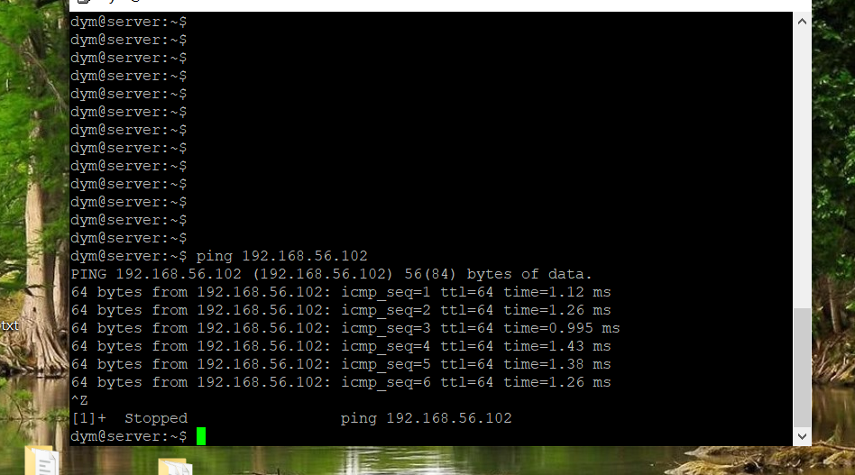

## 实验环境

+ 虚拟机：VirtualBox
+ server: ubuntu 18.04
    host-only: 192.168.56.101
+ client : ubuntu18.04
  + host-only: 192.168.56.102


## 客户端免密SSH登录服务器

### 两台主机互ping，看是否能通信





### 生成并导入SSH-KEY至服务器

+ 在客户端生成ssh-key

  ```shell
  # 生成公私钥 fo为key的名称
  ssh-keygen -f fo
  ```

+ 修改服务器的`/etc/ssh/sshd_config`配置

  ```shell
  # 设置可通过口令认证SSH
  PasswordAuthentication yes
  # 可以root用户登录
  PermitRootLogin yes
  # 重启服务器
  sudo systemctl restart ssh
  ```
  

+ 工作主机通过```ssh-copy-id```方式导入ssh-key

  ```shell
  ssh-copy-id -i ~/foo root@192.168.56.101
  ssh root@192.168.56.101
  ```
  

## FTP

### 实验文件
+ FTP服务器软件选择vsftpd
+ 脚本：[vsftpd.sh](scripts/vsftpd.sh)

+ 配置文件: [vsftpd.conf](configs/vsftpd.conf)

### 在服务器上运行`vsftpd.sh`脚本
```
  sudo bash vsftpd.sh
```


### 配置要求展示

+ 配置一个提供匿名访问的FTP服务器，匿名访问者可以访问1个目录且仅拥有该目录及其所有子目录的只读访问权限

  + 修改 /etc/vsftpd.conf文件
  ```
  anon_mkdir_write_enable=NO
  sudo service vsftpd restart
  ```

  + 提供匿名访问

    

  + 拥有一个目录及子文件的只读访问权限

    

+ 配置一个支持用户名和密码方式访问的账号，该账号继承匿名访问者所有权限，且拥有对另1个独立目录及其子目录完整读写权限

  + 支持用户名密码方式登录

    

  + cuc-dym用户具有对files文件夹及其子文件夹的完整读写权限

    

+ FTP用户不能越权访问指定目录之外的任意其他目录和文件

  

+ 匿名访问权限仅限白名单IP来源用户访问，禁止白名单IP以外的访问   

  


## NFS

### 实验文件

+ 脚本:[nfs_client.sh](scripts/nfs_client.sh),[nfs_host.sh](scripts/nfs_host.sh)
+ 配置文件[exports](configs/exports)

### 运行脚本

+ 服务器端运行脚本

  


+ 客户端运行脚本

  

  

### 配置要求展示

- 分别对应只读访问和读写访问权限
  - 创建的两个目录分别为:只读`/nfs/gen_r`和读写`/nfs/gen_rw`
      
      

  - 两个共享文件目录对应只读和读写访问权限
     

  - 通过NFS客户端在NFS共享目录中新建的目录、创建的文件的属主、权限信息
  

- 上述共享目录中文件、子目录的属主、权限信息和在NFS服务器端上查看到的信息一样吗？无论是否一致，请给出你查到的资料是如何讲解NFS目录中的属主和属主组信息应该如何正确解读

  + root_squash是为客户端分配服务器访问权限时的参数，其分别表示：  
    + no_root_squash：登入 NFS 主机使用分享目录的使用者，如果是 root 的话，那么对于这个分享的目录来说，他就具有 root 的权限！ 
    + root_squash：在登入 NFS 主机使用分享之目录的使用者如果是 root 时，那么这个使用者的权限将被压缩成为匿名使用者，通常他的 UID 与 GID 都会变成 nobody 那个系统账号的身份。  

## DHCP

### 实验文件
  - 脚本文件 [dhcp.sh](scripts/dhcp.sh)
  - 配置文件 
    - [/etc/dhcp/dhcpd.conf](configs/dhcpd.conf)
    - [/etc/default/isc-dhcp-server](configs/isc-dhcp-server)
  - 2台虚拟机使用Internal网络模式连接，其中一台虚拟机上配置DHCP服务，另一台服务器作为DHCP客户端，从该DHCP服务器获取网络地址配置
   > Internal模式:内网模式，即虚拟机与外网完全断开，只实现虚拟机于虚拟机之间的内部网络模式。
  
### 配置过程
  - 先将两台虚拟机增加网卡为`内部网络`网络模式,`client`:工作主机；`server`:目标主机
      * 注意界面名称必须一致
       
       
  
  - server配置
      * 通过`scp`将脚本`dhcp.sh`拷贝到目标主机，通过`ssh`方式远程执行脚本
      * 查看server配置文件
        
            $ cat /etc/netplan/01-netcfg.yaml

             network:
               version: 2
               renderer: networkd
               ethernets:
                 enp0s3:
                   dhcp4: yes
               enp0s8:
                 dhcp4: yes
               enp0s9:
                 #必须静态配置
                 dhcp4: no
                 addresses: [192.168.57.1/24]

  - client配置
      - 修改配置文件`/etc/netplan/01-netcfg.yaml`，添加`enp0s9`,设置`dhcp4: yes`
      - `sudo netplan apply`使配置生效
      - 查看client配置文件
            $ less /etc/netplan/01-netcfg.yaml

             network:
               version: 2
               renderer: networkd
               ethernets:
                 enp0s3:
                   dhcp4: yes
                 enp0s8:
                   dhcp4: yes
                 enp0s9:
                   dhcp4: yes
    
    - 实验结果
    
     
    可以看到服务器给客服端分配了IP 192.168.56.150
     
    

## DNS
  
  - 基于上述Internal网络模式连接的虚拟机实验环境，在DHCP服务器上配置DNS服务，使得另一台作为DNS客户端的主机可以通过该DNS服务器进行DNS查询
  - 在DNS服务器上添加 zone "cuc.edu.cn" 的解析记录
  
  - 配置文件：
     - [/etc/bind/named.conf.options](configs/named.conf.options)
     - [/etc/bind/named.conf.local](configs/named.conf.local)
     - [/etc/bind/db.cuc.edu.cn](configs/db.cuc.edu.cn)
  
  - server
  
    - 安装bind9：`sudo apt update && sudo apt install bind9`
    - 修改配置文件`sudo vim /etc/bind/named.conf.options`
           
          #在options选项中添加以下配置
          listen-on { 192.168.56.101; };  # ns1 private IP address - listen on private network only
          allow-transfer { none; }; # disable zone transfers by default
          forwarders {
             8.8.8.8;
              8.8.4.4;
          };
    - 编辑配置文件`sudo vim /etc/bind/named.conf.local`

          #添加如下配置
          zone "cuc.edu.cn" {
              type master;
              file "/etc/bind/db.cuc.edu.cn";
          };
    - 生成配置文件`db.cuc.edu.cn`
  
          $ sudo cp /etc/bind/db.local /etc/bind/db.cuc.edu.cn
    - 编辑配置文件`sudo vim /etc/bind/db.cuc.edu.cn`

    - 重启bind9：`sudo service bind9 restart`
  
  - client
     - 安装resolvconf：`sudo apt update && sudo apt install resolvconf`
     
     - 修改配置文件：`sudo vim /etc/resolvconf/resolv.conf.d/head`

            #添加配置
            search cuc.edu.cn
            nameserver 192.168.57.1
      - sudo resolvconf -u
  - 测试结果：
  
   
   
   


## Samba  
### 在windows 10客户端上连接Linux上的Samba服务器
    
  - 脚本文件 [smb_srv.sh](scripts/smb_srv.sh)
  - 配置文件 [/etc/samba/smb.conf](configs/smb.conf)

  - 执行脚本smb_srv.sh
    > 配置文件目录：`/etc/samba/smb.conf`
    > 服务启动：`/etc/init.d/smbd start`

  - 打开资源管理器，右键“此电脑”，选择“添加一个网络位置”
     
     
  - 输入共享文件夹路径
    
    
     
    

  - 访问匿名目录，不用输入账号密码，且不可以创建文件夹
    

  - 访问指定用户文件夹，需要输入账号密码，且可以创建文件夹，(注：此处的账号密码是之前配置过的samba用户与密码)
    
    
     
    

### 在Linux上连接Windows10上的服务器
  > sudo apt install smbclient
     
  - Windows设置共享目录
  
 

  - Linux访问Windows的匿名共享目录
    
     

  - Linux访问Windows的用户名密码方式共享目录
     

       未解决
    


## 参考资料


- [linux-2019-luyj](https://github.com/CUCCS/linux-2019-luyj/blob/Linux_exp0x06/Linux_exp0x06/Linux_exp0x06.md)
- [2015-linux-public-JuliBeacon](https://github.com/CUCCS/2015-linux-public-JuliBeacon/blob/exp6/%E5%AE%9E%E9%AA%8C%206/%E5%AE%9E%E9%AA%8C6.md)
- [2015-linux-public-JuliBeacon/pull/5/](https://github.com/CUCCS/2015-linux-public-JuliBeacon/pull/5/commits/48ad79ff47cd96a9d9990a38796556183cb49b19)
